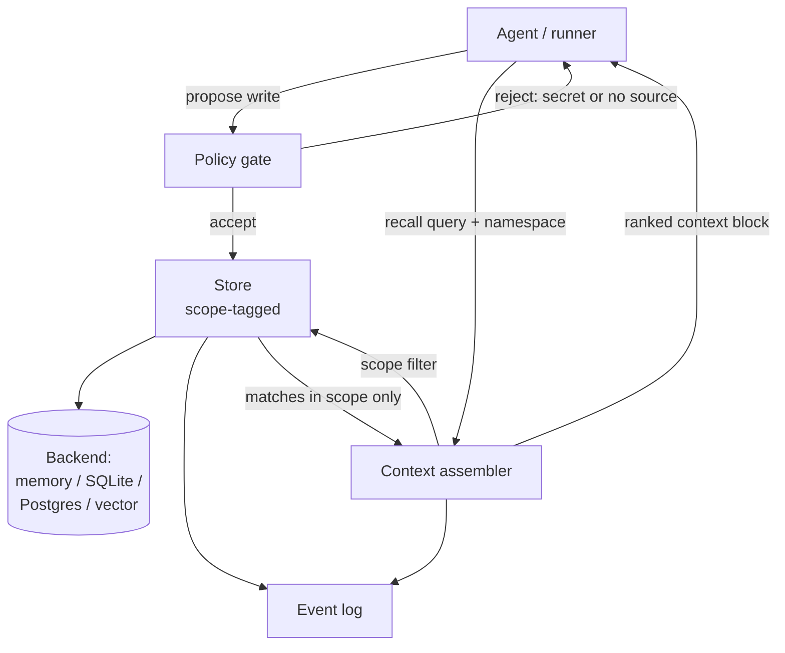

# Architecture

Memory Unlocked is a thin, auditable layer between your agents and whatever
storage backend you choose. The core is intentionally storage-agnostic: the
reference implementation ships an in-memory store, and you swap in a real
backend (SQLite, Postgres, a vector index, or an MCP-backed service) behind the
same interface.

## Components

| Component | Responsibility |
| --- | --- |
| **Memory model** | The atomic unit: a single durable fact with provenance. |
| **Namespace** | A `tenant / project` scope attached to every memory. |
| **Policy gate** | Validates every write: rejects secrets, requires a source. |
| **Store** | Persists memories and enforces scope on every read. |
| **Context assembler** | Selects, ranks, and renders scope-filtered context. |
| **Event log** | Append-only audit trail of writes and recalls. |

Each component is small and replaceable. The policy gate and the store are the
two security-critical pieces — keep their guarantees intact when you adapt them.

## Data flow

The key invariant: **nothing reaches the model on recall that was not written
under the same namespace.** Scope filtering happens inside the store, before
ranking, so a bug in ranking can never widen scope.

## Write path

1. The agent proposes a `Memory` (title, body, tags, namespace, source).
2. The **policy gate** runs:
   - reject if the body or title matches a secret pattern;
   - reject if there is no usable source reference;
   - normalize/redact any soft-flagged content.
3. On accept, the store assigns an id, tags it with the namespace, and writes it.
4. An event is appended (`memory.write`).

## Recall path

1. The agent asks the **context assembler** for context, passing a namespace and
   an optional query.
2. The store returns **only** memories whose namespace matches exactly.
3. The assembler ranks matches (recency + query overlap + tag match) and renders
   a bounded context block.
4. An event is appended (`memory.recall`).

## Namespace / scope policy

A namespace is a pair: `(tenant, project)`.

- **Exact match only.** Recall for `(t, p)` returns memories written to `(t, p)`.
  There is no implicit parent/child inheritance and no wildcard recall in the
  core. If you need shared memory, model it as an explicit, separate namespace
  and have the runner query both — never widen the store's filter.
- **Tenant isolation is the hard boundary.** Two tenants must never see each
  other's memories. Treat any cross-tenant read as a security incident.
- **Project is the soft boundary.** Within one tenant, projects are still
  isolated by default; sharing is opt-in and explicit.
- **Namespaces are part of provenance.** They are stored on the memory and
  emitted in events, so audits can answer "what scope did this come from?"

## Choosing a backend

The reference `MemoryStore` keeps everything in process for clarity and tests.
For production, implement the same surface (`add`, `query`, `all`) against your
storage of choice. Recommended properties:

- Scope filter pushed into the query (do not filter in Python after a broad read).
- Source and namespace stored as first-class columns/fields for auditing.
- Append-only event stream you can replay.
